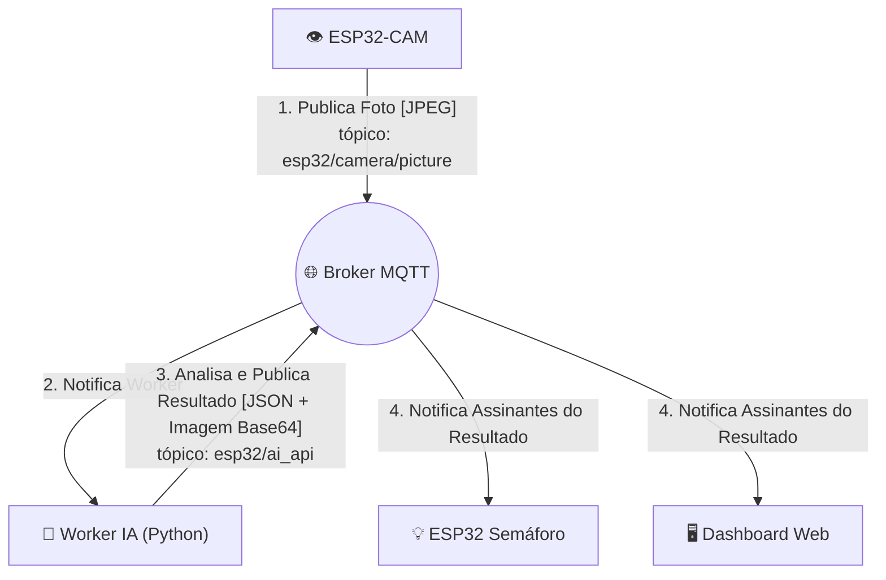

# 🚦 Sistema de Semáforo Inteligente com Visão Computacional


Um sistema completo de IoT e Inteligência Artificial que otimiza o fluxo de tráfego em tempo real, utilizando detecção de veículos para uma gestão de semáforos mais eficiente e inteligente.

---

## 📄 Sobre o Projeto

Este projeto implementa um sistema de semáforos inteligentes de ponta a ponta. A ideia central é substituir a temporização fixa e ineficiente por uma abordagem dinâmica baseada na demanda real, detectada por uma câmera e processada por uma Inteligência Artificial.

O sistema é composto por múltiplos componentes que se comunicam de forma assíncrona através de um broker MQTT, criando uma arquitetura robusta e escalável, típica de soluções de IoT modernas.

## ✨ Funcionalidades

* **Detecção de Veículos em Tempo Real:** Uma câmera ESP32-CAM monitora o tráfego constantemente.
* **Processamento com IA:** Um worker em Python utiliza um modelo de detecção de objetos (`transformers`) para identificar carros, ônibus e motos nas imagens.
* **Controle Dinâmico de Semáforo:** Um segundo ESP32, atuando como o controlador do semáforo, reage aos resultados da IA para otimizar o fluxo.
* **Comunicação via MQTT:** Todos os componentes (câmera, IA, semáforo, dashboard) são desacoplados e se comunicam através de um broker MQTT, garantindo flexibilidade.
* **Dashboard Web Interativo:** Uma interface web em tempo real, construída com HTML, CSS e JS, exibe o status dos semáforos e a última imagem processada com as detecções desenhadas.
* **Acionamento Manual:** O dashboard possui um botão para forçar uma nova detecção, permitindo interação e testes manuais.

## 🛠️ Arquitetura do Sistema

O fluxo de dados do sistema segue um padrão de publicação e inscrição (Pub/Sub), orquestrado pelo broker MQTT.



* **O Olho (`ESP32-CAM`):** Captura imagens do tráfego e as publica no broker.
* **O Mensageiro (`Broker MQTT`):** Um contêiner Docker com Mosquitto, responsável por receber e distribuir todas as mensagens.
* **O Cérebro (`Worker IA`):** Um script Python que assina o tópico de imagens, processa cada uma com um modelo de IA e publica o resultado (se um veículo foi detectado ou não, junto com a imagem processada).
* **O Atuador (`ESP32 Semáforo`):** Assina o tópico de resultados da IA e altera o estado dos LEDs (vermelho, amarelo, verde) com base na detecção.
* **A Interface (`Dashboard Web`):** Assina o tópico de resultados e de status dos semáforos para exibir as informações em tempo real para o usuário.

## 🚀 Como Executar

Siga os passos para configurar e executar o ecossistema completo.

#### Pré-requisitos
* [Docker](https://www.docker.com/get-started/) e Docker Compose
* [Python 3.9+](https://www.python.org/downloads/) e `pip`
* [Arduino IDE](https://www.arduino.cc/en/software) ou [PlatformIO](https://platformio.org/) para programar os ESP32s.
* Credenciais da sua rede Wi-Fi.

#### 1. Configuração do Broker MQTT
O broker é o coração do sistema. Usamos Docker para subir um contêiner Mosquitto de forma fácil e isolada.

```bash
# Na raiz do projeto, execute:
docker-compose up -d
```
Isso iniciará o broker Mosquitto, que estará escutando na porta `1883` (MQTT padrão) e `9001` (WebSockets).

#### 2. Configuração do Worker de IA (Python)
Este serviço irá consumir as imagens e processá-las.

```bash
# Crie e ative um ambiente virtual
python -m venv venv
source venv/bin/activate  # No Linux/macOS
# venv\Scripts\activate    # No Windows

# Instale as dependências
pip install -r requirements.txt

# Execute o worker
python ai_processor.py
```
O worker irá carregar o modelo de IA e se conectar ao broker, aguardando por imagens.

#### 3. Configuração dos ESP32
Você precisará de dois ESP32: um com uma câmera (ESP32-CAM) e outro para controlar os LEDs do semáforo.

1.  Abra os arquivos `camera.ino` e `semaforo.ino` na sua IDE (Arduino ou PlatformIO).
2.  **Edite as variáveis** no topo de cada arquivo com as credenciais da sua rede Wi-Fi e o endereço IP do computador que está rodando o broker MQTT.
3.  Compile e envie o código para cada ESP32 correspondente.
4.  Abra o Monitor Serial para acompanhar os logs e garantir que eles se conectaram ao Wi-Fi and MQTT.

#### 4. Executando o Dashboard Web
O dashboard é uma página estática.

1.  Edite o arquivo `script.js` e certifique-se de que a variável `BROKER_IP` contém o endereço IP correto do seu broker.
2.  Inicie um servidor web simples na pasta do projeto:
    ```bash
    python -m http.server
    ```
3.  Abra seu navegador e acesse `http://localhost:8000`.

## 🔧 Estrutura de Tópicos MQTT

| Tópico | Publicador | Assinante(s) | Descrição |
| :--- | :--- | :--- | :--- |
| `esp32/camera/picture` | ESP32-CAM | Worker IA | Publica a imagem bruta capturada pela câmera. |
| `esp32/ai_api` | Worker IA / Dashboard Web | ESP32 Semáforo, Dashboard Web | Publica o resultado da análise da IA (JSON com imagem processada). O dashboard também publica aqui com payload vazio para forçar uma nova detecção. |
| `esp32/semaforo_state/main_avenue` | ESP32 Semáforo | Dashboard Web | Publica o estado atual do semáforo da avenida principal. |
| `esp32/semaforo_state/cross_street` | ESP32 Semáforo | Dashboard Web | Publica o estado atual do semáforo da rua transversal. |

## 💻 Tecnologias Utilizadas

* **Hardware**: ESP32-CAM, ESP32
* **Linguagens**: Python, C++ (Arduino), JavaScript, HTML, CSS
* **IA / Machine Learning**: Hugging Face Transformers, PyTorch, `facebook/detr-resnet-50` model
* **Comunicação**: MQTT (Broker Mosquitto)
* **Containerização**: Docker, Docker Compose
* **Frontend**: HTML5, CSS3, JavaScript (Paho MQTT JS Library)

## 🖼️ Galeria

*(Aqui você pode adicionar screenshots do dashboard funcionando, uma foto do seu setup com os ESP32s, ou até um GIF do sistema em ação)*

**Dashboard em Operação:**


**Setup Físico:**


## 📄 Licença

Este projeto está sob a licença MIT. Veja o arquivo `LICENSE` para mais detalhes.

## 👤 Contato

**[Seu Nome]** - [seu.email@exemplo.com](mailto:seu.email@exemplo.com) - [LinkedIn](https://www.linkedin.com/in/seu-usuario/)

Link do Projeto: [https://github.com/seu-usuario/seu-repositorio](https://github.com/seu-usuario/seu-repositorio)